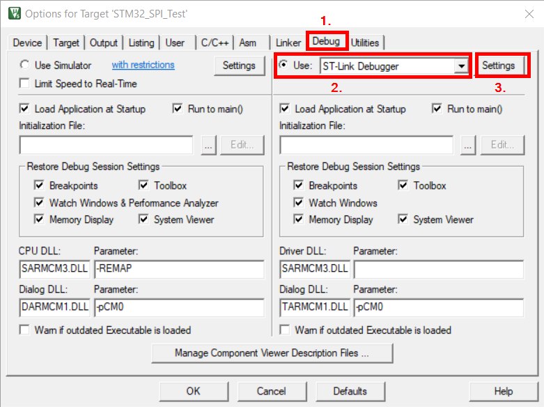

# Use STM32 Debuggers in Keil µVision 5

This document describes how to use a debugger or programmer for the STM32
MCUs from the Keil µVision 5 IDE.

# Motivation
Testing you code on a real hardware is a crucial step in the STM32 software
development process. According to my experience you'll probably program the
device many, many times and therefore the programming process should be
as fast and as efficient as possible!

# Step by Step instructions
1. Get a programmer. e.g. I started working with the [32F0308DISCOVERY](https://www.st.com/content/st_com/en/products/evaluation-tools/product-evaluation-tools/mcu-mpu-eval-tools/stm32-mcu-mpu-eval-tools/stm32-discovery-kits/32f0308discovery.html)
evaluation board. It also has a embedded `ST-LINK/V2` debug tool which can be
used for programming various STM32 MCUs.
2. Connect the programmer to your computer and install programmer drivers. This
step differs depending on your programmer. Simply follow the instructions from
the programmer manual.
3. Configure KEIL µVision:
    1. In the menubar click `Project` and then `Options for Target`.
    2. A new window will pop up. Select the `Debug` tab.
    3. Select the debugger you want to use (e.g. ST-Link Debugger)
    4. Click `Settings` to verify that the debugger is working. (You should be
        able to see a serial number.)

Awesome! Enjoy coding! =]
